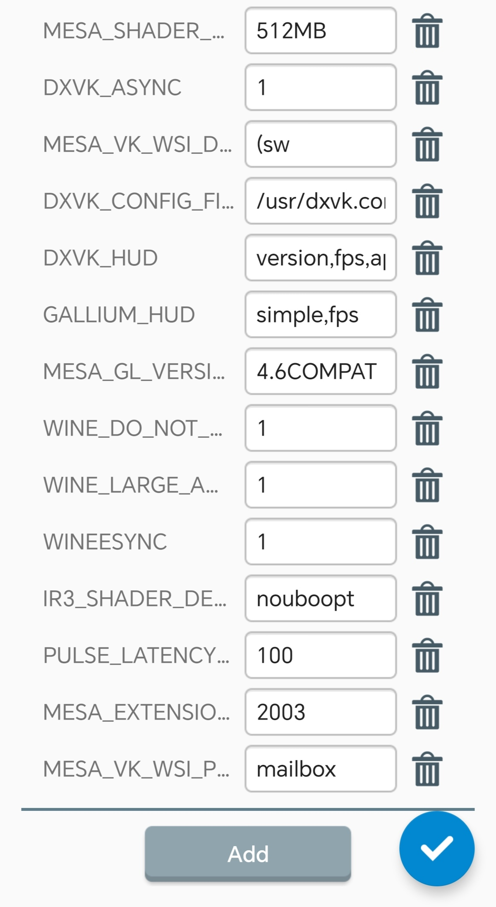

	  

# Winlator@Frost

Winlator@Frost is an Android application that lets you to run Windows (x86_64) applications with Wine and Box86/Box64. Originally modified from [Brunodev85](https://github.com/brunodev85/Winlator)

# Installation

1. Download and install the APK (Winlator@Frost 6.1 V1.apk) from [GitHub Releases](https://github.com/MrPhryaNikFrosty/Winlator-Frost/releases)
2. Launch the app and wait for the installation process to finish

----

----

# Useful Tips

- If you are experiencing performance issues, try changing the preset for Box86/Box64 in Container Settings -> Advanced Tab.
- For applications that use .NET Framework, try installing Wine Mono found in Start Menu -> System Tools.
- If some older games don't open, try changing the environment variable from MESA_EXTENSION_MAX_YEAR=2003 to 2000 in Container Settings -> Environment Variables.
- Try running the games using the shortcut on the Winlator home screen, there you can define individual settings for each game.
- If the game running in low fps, try removing some extra env from here

	  

# Credits and Third-party apps
- Ubuntu RootFs ([Focal Fossa](https://releases.ubuntu.com/focal))
- Wine ([winehq.org](https://www.winehq.org/))
- Box86/Box64 by [ptitseb](https://github.com/ptitSeb)
- PRoot ([proot-me.github.io](https://proot-me.github.io))
- Mesa3D ([mesa3d.org](https://www.mesa3d.org))
- DXVK ([github.com/doitsujin/dxvk](https://github.com/doitsujin/dxvk))
- D8VK ([github.com/AlpyneDreams/d8vk](https://github.com/AlpyneDreams/d8vk))
- CNC DDraw ([github.com/FunkyFr3sh/cnc-ddraw](https://github.com/FunkyFr3sh/cnc-ddraw))

Many thanks to [ptitSeb](https://github.com/ptitSeb), [alexvorxx](https://github.com/alexvorxx) and others.
Thank you to all the people who believe in this project.
